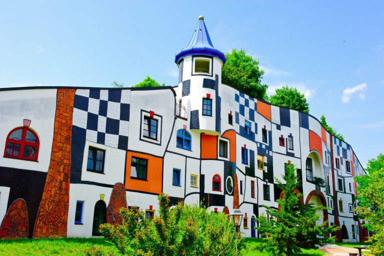

# Alquileres

Nos piden construir un modelo cuyo objetivo es informatizar parte de la información de los departamentos que se ofrecen para alquiler en Ciudad Gótica.

## 1. Departamentos, artefactos.
De cada departamento se informa: la _superficie_ en metros cuadrados, la _cantidad de habitaciones_, el barrio (p.ej. "Boedo") y los artefactos.
Estos últimos (los artefactos) aportan distintas características al departamento en la que se colocan.

A partir de estos datos, debe poder obtenerse la siguiente información referida a un departamento:
- _es espacioso_: un departamento de hasta 2 habitaciones se considera espacioso si su superficie es más de 45 metros cuadrados. Si tiene más de dos habitaciones, entonces para considerarlo espacioso, la superficie debe superar 75 metros cuadrados.
- _consumoElectrico_: se calcula como `cantidad de habitaciones * 300`, más la suma de lo que consume cada artefacto. La unidad de medida es el watt/hora.
- _accesorio más alto_, considerando que se puede consultar la altura de cada accesorio.
- _tiene calefacción_: es verdadero si al menos uno de los artefactos del departamento da calor.

Se deben contemplar los siguientes artefactos
1. **Estufa de cuarzo**: consume 700 watt/hora, altura 60 cm, da calor.
2. **Aire acondicionado**: de cada equipo de aire acondicionado se informan las frigorías, y si es o no frío/calor. El consumo eléctrico se calcula como `frigorias / 4`, la altura como `40 + (frigorias / 100)`. Si es frío/calor entonces da calor; si no, no.
3. **Mesa**: para cada mesa se informa la altura de las patas, y si tiene o no borde luminoso. Consumo eléctrico: 80 watt/hora si tiene borde luminoso, 0 si no. Altura: si tiene borde luminoso `alturaPatas + 25`, si no `alturaPatas + 20`. No da calor.

Agregar un método para consultar la _cantidad de artefactos de alto consumo_ de un departamento, o sea, la cantidad de accesorios cuyo consumo eléctrico es de más de 400 watt/hora.

 

Van tres ejemplos de departamentos.
* un departamento de 120 metros cuadrados, 5 habitaciones, en Hurlingham. Como accesorios tiene: una estufa de cuarzo, un aire acondicionado frío/calor de 2400 frigorías, y una mesa con 80 centímetros de altura de patas con borde luminoso.  
Este departamento: es espacioso, el consumo eléctrico es 2880 watts/hora, el accesorio más alto es la mesa, tiene calefacción, y tiene dos artículos de alto consumo (la estufa y el aire).
* un departamento de 50 metros cuadrados, 2 habitaciones, en Villa Tesei. Como accesorios tiene: un aire acondicionado frío solo (o sea, que no es frío/calor) de 3000 frigorías, y una mesa con 25 centímetros de altura de patas sin borde luminoso.  
Este departamento: es espacioso, el consumo eléctrico es 1350 watts/hora, el accesorio más alto es el aire, no tiene calefacción, y tiene un artículo de alto consumo (el aire).
* un departamento de 60 metros cuadrados, 4 habitaciones, en Villa Tesei. Como accesorios tiene: un aire acondicionado frío/calor de 1000 frigorías, y una mesa con 75 centímetros de altura de patas sin borde luminoso.  
Este departamento: no es espacioso, el consumo eléctrico es 1450 watts/hora, el accesorio más alto es la mesa, tiene calefacción, y no tiene artículos de alto consumo.

 

## Inmobiliarias

Agregar al modelo las **inmobiliarias**. Para cada inmobiliaria, se indican los departamentos que ofrece en alquiler.

Agregar métodos para consultar, dada una inmobiliaria
- la colección de sus _departamentos familiares_. Un departamento se considera familiar si tiene 3 o más habitaciones.
- la colección formada por el _barrio_ de cada departamento, sin repetidos.
- si la inmobiliaria _tolera el invierno_ o no. La condición es que al menos uno de los departamentos que alquila tengan calefacción.
- si _puede certificar bajo consumo_, para una cantidad de watts/hora. La condición es para todos los departamentos que alquila, el consumo eléctrico sea menor o igual a la cantidad indicada.

 

Por ejemplo, para una inmobiliaria que tiene en alquiler los tres departamentos descriptos en el punto anterior:
- los departamentos familiares son el primero y el tercero.
- los barrios son Villa Tesei y Hurlingham.
- tolera el invierno. 
- puede certificar bajo consumo para 3000 watts/hora, no puede para 2000 watts/hora. 

 

## 3. Más sobre las inmobiliarias

Agregar métodos para poder consultar, para una inmobiliaria
- el _barrio del departamento más grande_ (o sea, de mayor superficie).
- la _cantidad de departamentos_ con más de 2 accesorios.
- el _consumo total en departamentos compactos_, que es la suma del consumo eléctrico de los departamentos de menos de 70 metros cuadrados.

 

## 4. Departamentos compatibles

Se dice que dos departamentos son _compatibles_ si: están en el mismo barrio, y además sus superficies no difieren en más de 10 metros cuadrados.  
Se pide agregar lo necesario para poder consultar, para una inmobiliaria, cuáles de los departamentos que ofrece en alquiler son compatibles con un departamento que se pasa por parámetro.

